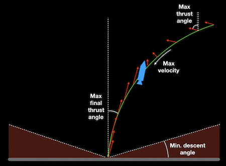

HopperGuidance
==============

A KSP mod which enables the calculation of a fuel efficient trajectory in-flight to make a soft landing at a designated location respecting the capabilities of the craft. The craft will then be steered automonously to follow this trajectory. You can choose many parameters of the trajectory to make it safe or more exciting.

Features
- Choose a landing latitude, longitude and altitude
- Shows the trajectory to landing and require thrust vectors
- Lets you tune the parameters to the craft

You can choose a particular latitude and longitude and altitude to land at, although currently this works best close to the landing site such as within 10km. It certainly handle descent from orbit very well
as it suffers from Flat Earthism and treats the planet surface as flat and doesn't understand orbits or
atmospheric drag. It may waste quick a bit of fuel trying to keep to the pre-calculated trajectory too. You can give it a try though, its all good run.

The algorithm used is aimed to be an implementation of the G-FOLD algorithm for fuel optimal diverts
reputably used by Lars Blackmore for landing the SpaceX Falcon-9 rocket. However my algorithm is simplified version. See later.

References

-  "G-FOLD: A Real-Time Implementable Fuel Optimal Large Divert Guidance Algorithm for Planetary Pinpoint Landing" https://www.researchgate.net/publication/258676350_G-FOLD_A_Real-Time_Implementable_Fuel_Optimal_Large_Divert_Guidance_Algorithm_for_Planetary_Pinpoint_Landing.

- "Convex Programming Approach to Powered Descent Guidance for Mars Landing" https://arc.aiaa.org/doi/abs/10.2514/1.27553

- "Minimum-Landing-Error Powered-Descent Guidance for Mars Landing Using Convex Optimization" http://www.larsblackmore.com/BlackmoreEtAlJGCD10.pdf

Prerequistes
============

Tested with KSP version 1.8.1. May work with later versions.
If you want to run the solver outside of KSP you need python and matplotlib to show the trajectories.

Installing
==========

Copy GameData to your KSP installation

Using HopperGuidance
====================

Creates a new part, HopperGuidanceCore. Right-click to get its UI up.

Setting the target position. Click "Set Target Position" to set and landing target to where you are now.
A flickery red cross will be shown at that position.

Once in flight click "Enable autopilot" to automatically calculate a trajectory to safely land at the target point. Its not recommended that you do this more than 5km from the target currently. A trajectory will be shown in green with the calculated thrust direction and magnitude in red. The craft will be steered to attempt to follow this trajectory. You may get the message "Failed: try again" in which case the craft is likely to be either: too far away, beyond max velocity or below the minimum descent angle. Try to resolve these and try again.

You can cancel the autopilot with "Disable autopilot" and take control again. You might want to do this to recalculate the trajectory if the craft has diverged too much from it.

Control parameters. The algorithm is in two parts.

1. Calculating a trajectory
2. Following the trajectory

Parameters for (1) are used to compute the trajectory and can be used to control how 'tame' the trajectory is or how exciting is. If you want your craft to come slowly and gently down from above like Blue Origin you can choose the slightly more exciting Space X Falcon 9 landing, or more extreme doomed to failure trajectories coming in fast and very low.

- Target latitude
- Target longitude
- Target altitude
- Min. descent angle - imagine an upside down cone with the apex at the landing point. The cone describes the safe area of descent. A high angle to the ground means the craft must descent steeply, only getting near the ground at the landing point.
- Max velocity - Keep velocity below this limit
- Max thrust angle - the maximum allow angle the craft will tilt. If 90 degrees then the craft can tip from vertical to the horizontal position but no more
- Max final thrust angle - the thrust angle for the touch down. This keeps the final descent more vertical if kept lower than max thrust angle
- Min thrust - only throttle down to this amount. This is mainly for realism overhaul where throttling of engines is more realistic. If the engine cuts out you will only have limited ignitions and it takes quite a while to restart the engine. You just can't let it happen!
- Max thrust - how much of the available thrust to use. Set this slow and the descent will be slow and careful. You can use more than 100% since the calculation is done when calculating the trajectory you might have lost weight due to fuel usage and you will have spare acceleration by landing.
- Time penalty - by default with a time penalty of zero the solution will minimize fuel usage. Setting a penalty of time will encourage a faster time to landing at the expense of extra fuel. You might want to use this on low gravity otherwise your craft may be allowed to drift upwards so a long time to make best use of gravity

While can you set target latitude, longitude and altitude its far easier to click "Pick Target" then click on the main view to select the target. You will need to increase the target size to see far away targets. Note that the target is horizontal so it will get hidden on slopes.

Parameters for (2) describe what to do when the craft is off the trajectory. The nearest point on the trajectory is marked by a blue line from the craft to the trajectory. This nearest point takes into account and position and velocity with a little more weight for velocity. This makes the craft behave more smoothly rather than blindy aiming for the nearest point in position. So the craft tries to match the position and velocity of the nearest point. If calculates a correct to the thrust vector to try and minimise the discrepancy. Six PID controllers are used to achieve this. 3 for the X,Y and Z positions and 3 for X, Y and Z velocities.

- Idle attitude angle - If the craft is pointing more this angle away from the required direction of thrust then idle the engine at 0.1% thrust. This prevent the craft thrusting in the wrong direction and waits of it to point correctly
- Err. Position gain - Sets the velocity to aim to close the position error. If set of 1 then when 1m aware aim for a velocity of 1m/s towards the target. 0.2 to 0.4 are good values.
- Velocity gain - If set of 1 then when the target velocity is out by 1m/s than accelerate at 1m/s2

Heres a diagram to explain some of the parameters



General tips:

Have sufficient RCS for your craft so it can change its attitude reasonably quickly
Enable RCS
If you get a failure to compute a solution when clicking "Enable autopilot" check if you are below to min descent angle and if you are above the max velocity. If you are then a solution may be impossible.
If your craft comes in too low to land either reduce max final thrust angle to land more vertically or increase min descent angle


Dealing with Small Craft:

Small craft are exciting, like a sports car.
You can try and push of max velocity, max thrust angle, max final thrust angle, and max thrust to high values. The craft will then be able to move quickly and accelerate quickly leads to exciting but possible risky landings.

Dealing with Large Craft:

You may have a problem using the autopilot with large craft. A large craft is hard to maneoveure since it has high mass and will take time to change its attitude. This leads to it pointing is the wrong direction and either thrusting in that wrong direction or waiting to change its attitude. Both these mean it cannot following the track. Another problem is that atmospheric drag is not including in when solving for the best trajectory. Doing so its possible with this technique because it would make the problem non-linear. So heres some tips for dealing with large craft

- Reduce max velocity to keep atmospheric drag low
- Keep max thrust angle low, says <15 degress as this will keep the craft more upright and prevent dangerous oscillation in attitude
- Keep final max thrust angle even lower. Making it zero will mean the craft must descend vertically for the touch down
- Lower position gain to say 0.1 to 0.2. This will mean if the craft is off trajectory it will only move slowly towards the correct trajectory. If this value is too higher it will overshoot
- Raise the final descent angle above 45 degrees, may be as high as 80 degrees to give a more vertical landing
- You can compensate for the lack of ability to steer the craft by adding more RCS thrusters or overly powerfull rotation wheels.
- Reduce max thrust below 100%. This will mean spare thrust will be available to correct errors in sticking to the trajectory
- Reduce Err. extra thrust angle to say 10-20 degrees which will prevent the craft leaning too much and being hard to regain the upright position
- However note that if tie down all these parameters too much you can end up with really complex trajectories which try to fit all these constraints which can be ridiculously inefficient.

Debugging
=========

If you have a problem look in the KSP directory for KSP.log
Lines are proceeded by HopperGuidance:. 
You will be able to find all the parameters when either a solution was requested and found or it failed. You can rerun by taking the parameters from the log line and using them directly on the command line of Solve.exe outside of KSP. See below.


Testing
=======

There is a way to run the algorithm outside of KSP via Solve.exe.
I'm running on the Mac so I run
```
mono ./Solve.exe r0=[40,500,20] v0=[10,10,10] g=9.8 > solution.dat
```
for example and this produces a data file with a trajectory.
This can be plotted (via matplotlib) by running

./plotXYZ.py solution.dat

You can also run all the tests by running

./run_tests.sh

This is all designed to run on a Mac where you have a bash shell. It should be failing easy to convert though.

Compilation
===========

Running on a Mac I used Mono to compile C#.
I couldn't get the Mac Visual Studio to use the correct version of Mono for KSP.
But I did manage to get it to work with the Makefile.
Just type
```
make
```
But I include the Visual Studio project as it may be easy to get running on a Windows machine or on a Mac with some configuration hacks. Any help on this much appreciated.

Locations
=========

You can type these values in for the landing site. Yeah, or know that is quite awkward to do right now.
Its much easier to use "Pick target" if you can see the target.

Kerbin:

- KSC H-Pad: latitude=-0.0968 longitude=-74.6172 altitude=180
- Island ATC Tower: latitude=-1.5233 longitude=-71.911 altitude=182
- KSC Water tower: latitude=-0.0922 longitude=-74.55251 altitude=102

ALGLIB
======

I make use of the free version of ALGLIB for convex optimisation. I use the free version provided until the GPL. Heres a description of ALGLIB from alglib.net

ALGLIB is a cross-platform numerical analysis and data processing library. It supports several programming languages (C++, C#, Delphi) and several operating systems (Windows and POSIX, including Linux). ALGLIB features include:

- Data analysis (classification/regression, statistics)
- Optimization and nonlinear solvers
- Interpolation and linear/nonlinear least-squares fitting
- Linear algebra (direct algorithms, EVD/SVD), direct and iterative linear solvers
- Fast Fourier Transform and many other algorithms
- ALGLIB Project offers you several editions of ALGLIB:

Details on the Algorithm
========================

My implementation is not quite the same as the 'proper' G-FOLD algorithm. I made some simplifications due to the convex solver code I had available and in some cases due to my lack of understanding.
The full solution makes account of the consumption of fuel and the improved acceleration when mass drops due to this. Mine does not. If you run out of fuel then sorry.

The proper G-FOLD uses a Second Order Cone Programming (SOCP) solver. This is fancy stuff, but bascially it means that various constraints such a thrust directions and minimum descent angle are all cones. You can see that they are since they are a maximum angle from the vertical in all directions.
I couldn't find a SOCP solver but I could find a Quadratic Programming (QP) solver in the shape of alglib. See alglib.net. This means I use 4 planes rather than a cone so its an approximation that you probably won't notice.

To follow the trajectory I use 6 PID controllers. There are a pair of controller for each X, Y and Z. The controllers are very simple using only the proportial element, kP. The 1st controller say for the X axis sets a target (or setpoint) for the velocity, VX given the error in the X position. kP is given by "Err. position gain". So this says aim to move towards the X position at this speed. Then the second PID for X set the acceleration in the X direction given the mismatch between the velocity desired given the target velocity and the current velocity. kP is this controller is set from "Err. velocity gain". This is done for the three dimensions and gives a desired correction thrust vector. Note this is onto of the thrust vector already computed from the solution. Finally we need to now the target position and velocity. This is calculated by finding the nearest position and velocity on the track with a weighting given to use. Plus we interpolate along the line segment from the solution via calculating the nearest 'point' to a line in six dimensions (position + velocity).  This combination leads to a smoother following of the solution track.

Adrian Skilling

adrian.skilling@gmail.com
